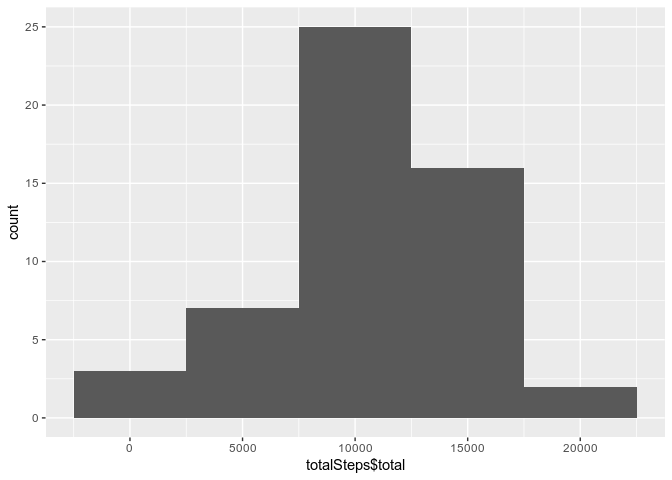
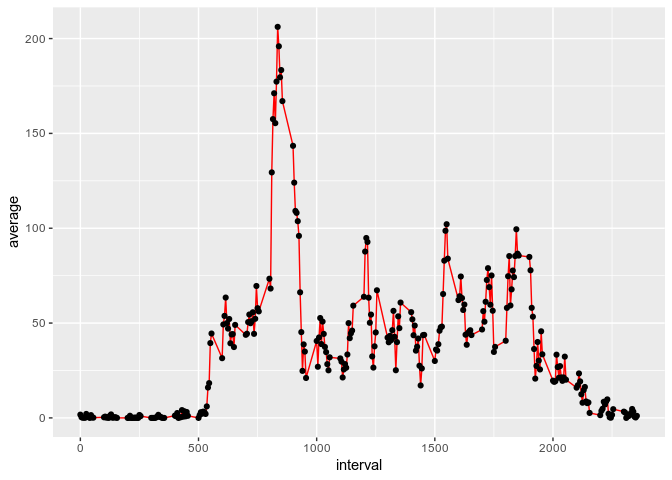
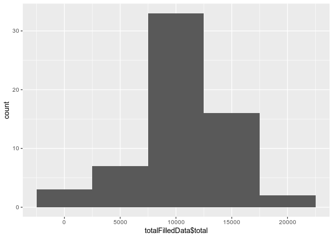
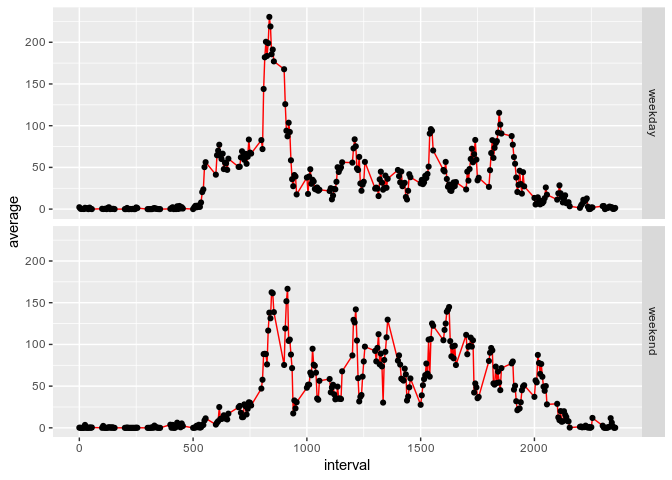

# Reproducible Data Assignment

### Load in relevant packages


```r
library(dplyr)
```

```
## 
## Attaching package: 'dplyr'
```

```
## The following objects are masked from 'package:stats':
## 
##     filter, lag
```

```
## The following objects are masked from 'package:base':
## 
##     intersect, setdiff, setequal, union
```

```r
library(ggplot2)
```

Read in relevant data with:


```r
rawData <- read.csv("/home/rene/R/Coursera/Reproducible Research/activity.csv")
rawData <- tbl_df(rawData) %>%
        group_by(date)
```

### What is mean total number of steps taken per day?


```r
totalSteps <- summarise(rawData, total = sum(steps))

ggplot(data=totalSteps, aes(totalSteps$total)) + 
        geom_histogram(binwidth = 5000)
```

```
## Warning: Removed 8 rows containing non-finite values (stat_bin).
```

<!-- -->

The table below describes the mean and median of the total steps taken.


```r
summary(totalSteps)
```

```
##          date        total      
##  2012-10-01: 1   Min.   :   41  
##  2012-10-02: 1   1st Qu.: 8841  
##  2012-10-03: 1   Median :10765  
##  2012-10-04: 1   Mean   :10766  
##  2012-10-05: 1   3rd Qu.:13294  
##  2012-10-06: 1   Max.   :21194  
##  (Other)   :55   NA's   :8
```

### What is the average daily activity pattern?


```r
timeData <- ungroup(rawData)
timeData <- group_by(timeData, interval)
timeDataMean <- summarise(timeData, average = mean(steps, na.rm = TRUE))

ggplot(data=timeDataMean, aes(x=interval, y=average)) +
        geom_line(color="red")+
        geom_point()
```

<!-- -->

The maximum peak of steps taken over the course of a day.


```r
# Provides the max value of 
timeDataMean[which.max(timeDataMean$average),]
```

```
## # A tibble: 1 x 2
##   interval average
##      <int>   <dbl>
## 1      835    206.
```

### Imputing missing values

What is the number of missing values in the dataset I have to impute?


```r
# Calculate and report number of missing values in the dataset
sum(is.na(rawData$steps))
```

```
## [1] 2304
```

Imputing missing values. As can be seen in the summary of the data, the imputed
version does not hugely differ from the original one. Imputing does not to have
a significant effect on the mean and median of the data.


```r
filledData <- mutate(rawData, 
                     stepsFilled = ifelse(is.na(steps), 
                                          timeDataMean$average[which(timeDataMean$interval == interval)], 
                                          steps))

totalFilledData <- summarise(filledData, total = sum(stepsFilled))

# The plot and the summary shows that imputing the data does not have a huge
# effect on the result (e.g. mean & median)
ggplot(data=totalFilledData, aes(totalFilledData$total)) + 
        geom_histogram(binwidth = 5000)
```

<!-- -->

```r
summary(totalFilledData)
```

```
##          date        total      
##  2012-10-01: 1   Min.   :   41  
##  2012-10-02: 1   1st Qu.: 9819  
##  2012-10-03: 1   Median :10766  
##  2012-10-04: 1   Mean   :10766  
##  2012-10-05: 1   3rd Qu.:12811  
##  2012-10-06: 1   Max.   :21194  
##  (Other)   :55
```

### Are there differences in activity patterns between weekdays and weekends?

The average amount of steps taken during the day tends to peak less during the 
weekend and becomes more normal distributed.


```r
filledData$date <- as.Date(filledData$date)

filledData <- mutate(filledData, dayType = weekdays(date)) %>%
        mutate(dayType = ifelse(dayType != "Samstag" & dayType != "Sonntag",
                                "weekday", "weekend")) %>%
        ungroup() %>%
        group_by(interval, dayType)

filledDataSum <- summarise(filledData, average = mean(stepsFilled))

p <- ggplot(data = filledDataSum, aes(x = interval, y = average)) + 
        geom_line(color="red")+
        geom_point()

p + facet_grid(dayType ~ .)
```

<!-- -->
